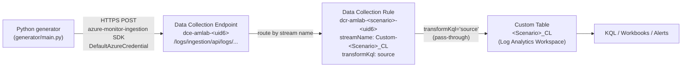

# Architecture: Azure Monitor Observability Demo Lab

> **Last updated:** 2026-07-21  
> **Scope:** Logs Ingestion API stack — from Bicep deployment to queryable KQL tables. Includes the additive Azure Policy governance demo.

---

## Overview

The lab provisions a complete **Logs Ingestion API** pipeline in a single Azure subscription using a subscription-scoped Bicep deployment. Synthetic telemetry from a Python generator flows over HTTPS through a Data Collection Endpoint, is routed by scenario-specific Data Collection Rules, and lands in custom Log Analytics tables — all queryable via KQL, Azure Monitor Workbooks, and Scheduled-Query Alert rules.

---

## Ingestion Path



**ASCII fallback:**

```
generator/main.py
    │
    │  HTTPS POST  (azure-monitor-ingestion SDK + DefaultAzureCredential)
    │  Body: JSON array of records, stream: Custom-<Scenario>_CL
    ▼
Data Collection Endpoint  (dce-amlab-<uid6>)
    │  logsIngestionEndpoint URL from lab.env → DCE_LOGS_INGESTION_ENDPOINT
    │
    │  DCR immutableId from lab.env → DCR_IMMUTABLE_ID_<SCENARIO>
    ▼
Data Collection Rule  (dcr-amlab-<scenario>-<uid6>)
    │  inputStream  = Custom-<Scenario>_CL
    │  transformKql = 'source'   (no column mutation)
    │  outputStream → <Scenario>_CL (workspace table)
    ▼
Log Analytics Workspace  (law-amlab-<uid6>)
    │  table: <Scenario>_CL
    ▼
KQL queries / Azure Monitor Workbooks / Scheduled-Query Alert rules
```

---

## Resource Hierarchy

```
Azure Subscription
└── rg-amlab                                    (Resource Group)
    ├── law-amlab-<uid6>                         (Log Analytics Workspace)
    │   ├── VirtualMachines_CL                   (Custom Table)
    │   ├── AppService_CL                        (Custom Table)
    │   ├── AKS_CL                               (Custom Table)
    │   ├── AzureSQL_CL                          (Custom Table)
    │   └── APM_CL                               (Custom Table)
    ├── dce-amlab-<uid6>                         (Data Collection Endpoint)
    ├── dcr-amlab-virtualmachines-<uid6>         (Data Collection Rule)
    ├── dcr-amlab-appservice-<uid6>              (Data Collection Rule)
    ├── dcr-amlab-aks-<uid6>                     (Data Collection Rule)
    ├── dcr-amlab-azuresql-<uid6>                (Data Collection Rule)
    ├── dcr-amlab-apm-<uid6>                     (Data Collection Rule)
    ├── [workbook — planned]                     (Azure Monitor Workbook)
    ├── [alert rules — planned]                  (Scheduled-Query Alert Rules)
    └── dep-diag-kv-amlab                        (Azure Policy assignment — DeployIfNotExists, deployPolicy=true)
        └── system-assigned identity            → Monitoring Contributor + Log Analytics Contributor (RG-scoped)
            └── auto-deploys diagnostic settings on any Key Vault → law-amlab-<uid6>
```

`<uid6>` = `take(uniqueString(subscriptionId, namePrefix), 6)` — deterministic, stable across re-deployments.

---

## Resource Inventory and API Versions

| Resource | Bicep type | API version | Count |
|---|---|---|---|
| Resource Group | `Microsoft.Resources/resourceGroups` | `2022-09-01` | 1 |
| Log Analytics Workspace | `Microsoft.OperationalInsights/workspaces` | `2023-09-01` | 1 |
| Data Collection Endpoint | `Microsoft.Insights/dataCollectionEndpoints` | `2023-03-11` | 1 |
| Custom Table | `Microsoft.OperationalInsights/workspaces/tables` | `2023-09-01` | 5 |
| Data Collection Rule | `Microsoft.Insights/dataCollectionRules` | `2023-03-11` | 5 |
| Azure Monitor Workbook | `Microsoft.Insights/workbooks` | _(planned)_ | 1 |
| Scheduled-Query Alert | `Microsoft.Insights/scheduledQueryRules` | _(planned)_ | ~13 |
| Policy Assignment (governance demo) | `Microsoft.Authorization/policyAssignments` | `2024-04-01` | 1 |
| Role Assignment (policy identity) | `Microsoft.Authorization/roleAssignments` | `2022-04-01` | 2 |

> API versions validated against [learn.microsoft.com](https://learn.microsoft.com/en-us/azure/templates/) on 2026-07-15.
> The governance-demo resources (policy + role assignments) are gated by `param deployPolicy bool = true` and validated on 2026-07-21.

---

## Bicep Deployment Model

`infra/main.bicep` is **subscription-scoped** (`targetScope = 'subscription'`). It:

1. Creates the Resource Group via `modules/resource-group.bicep`.
2. Deploys the Log Analytics Workspace (`modules/log-analytics.bicep`) and DCE (`modules/data-collection-endpoint.bicep`) in parallel into the RG.
3. Iterates `scenarioConfigs` (a Bicep array of 5 objects) to deploy one Custom Table per scenario via `modules/custom-table.bicep`.
4. After tables exist, iterates again to deploy one DCR per scenario via `modules/data-collection-rule.bicep`.
5. Exports `dcrOutputs` (array of `{scenario, immutableId, dcrId}`), `workspaceId`, `workspaceName`, `dceLogsIngestionEndpoint`, `dceId`, and `resourceGroupName` — consumed by `scripts/deploy` to write `config/lab.env`.
6. When `deployPolicy` is `true` (default), deploys `modules/policy-keyvault-diagnostics.bicep` at RG scope (after the workspace exists): a DeployIfNotExists policy assignment (`dep-diag-kv-amlab`) with a system-assigned identity, plus the two role assignments that identity needs to remediate. Exposes `policyKeyVaultDiagnosticsAssignmentName` / `…AssignmentId` outputs. See the [Azure Policy Diagnostics Walkthrough](policy-diagnostics-walkthrough.md).

Default parameters: `location = 'southcentralus'`, `namePrefix = 'amlab'`, `deployPolicy = true`.

---

## The Five Scenarios and Workshop Deck Alignment

Each scenario maps to a slide cluster in the *Azure Monitor Observability Workshop* deck (slides 34–38). The lab's KQL files, workbook panels, and alert rules are designed to demonstrate the signals highlighted in those slides.

| # | Scenario | Table | Deck slides | Watch signals | Alerts & SLOs |
|---|---|---|---|---|---|
| 1 | **Virtual Machines** | `VirtualMachines_CL` | Slide 34 | CPU %, memory, disk free %, network I/O, heartbeat | CPU > 90 %, disk < 10 %, heartbeat silence |
| 2 | **App Service / PaaS** | `AppService_CL` | Slide 35 | Request rate, response time (mean + P95), 5xx/4xx counts, restarts, plan CPU/mem | 5xx rate > 5 %, P95 latency > 2 000 ms |
| 3 | **AKS / Containers** | `AKS_CL` | Slide 36 | Node/pod CPU/mem, CrashLoopBackOff, pod restarts, node status, PV usage, HPA | CrashLoopBackOff any pod, node NotReady |
| 4 | **Azure SQL** | `AzureSQL_CL` | Slide 37 | DTU %, CPU %, connections (active/failed), deadlocks, storage %, query duration P95 | DTU > 85 %, storage > 90 %, deadlocks > 0 |
| 5 | **Applications (APM)** | `APM_CL` | Slide 38 | Golden signals: rate, errors, P50/P95 latency, dependency failures, trace IDs | Failure rate > 1 %, P95 > 500 ms, error-budget burn |

### KQL → Workbook → Alert alignment

Every KQL file under `kql/` defines the same queries used by:
- The corresponding workbook in `workbooks/` (panels reference the `.kql` content).
- The Scheduled-Query Alert rules (using `alertThresholds` from `mouse-kql-schema.md`).

This ensures the demo's visual panels and alert conditions are always in sync.

---

## Generator → Lab Integration

The Python generator (`generator/main.py`) reads `config/lab.env` at startup via `generator/config.py`:

| `lab.env` variable | Used for |
|---|---|
| `DCE_LOGS_INGESTION_ENDPOINT` | HTTPS target for the `azure-monitor-ingestion` SDK |
| `DCR_IMMUTABLE_ID_<SCENARIO>` | Identifies which DCR receives each stream |
| `LAB_RESOURCE_GROUP` | Populates `ResourceId` ARM path template |
| `LAB_SUBSCRIPTION_ID` | Populates `ResourceId` ARM path template |
| `LAB_LOCATION` | Populates `Region` field |

The generator submits records using `DefaultAzureCredential`. The uploading principal must hold the **Monitoring Metrics Publisher** role (`3913510d-42f4-4e42-8a64-420c390055eb`) on each DCR and on the DCE.

---

## Dependency Graph

```
[Resource Group]
       │
       ├──────────────────────────────┐
       ▼                              ▼
[Log Analytics Workspace]     [Data Collection Endpoint]
       │
       ▼ (5×)
[Custom Table: <Scenario>_CL]
       │
       ▼ (5×, dependsOn customTables)
[Data Collection Rule: dcr-amlab-<scenario>-<uid6>]
       │
       ▼ (planned)
[Workbook]   [Scheduled-Query Alert Rules]
```
